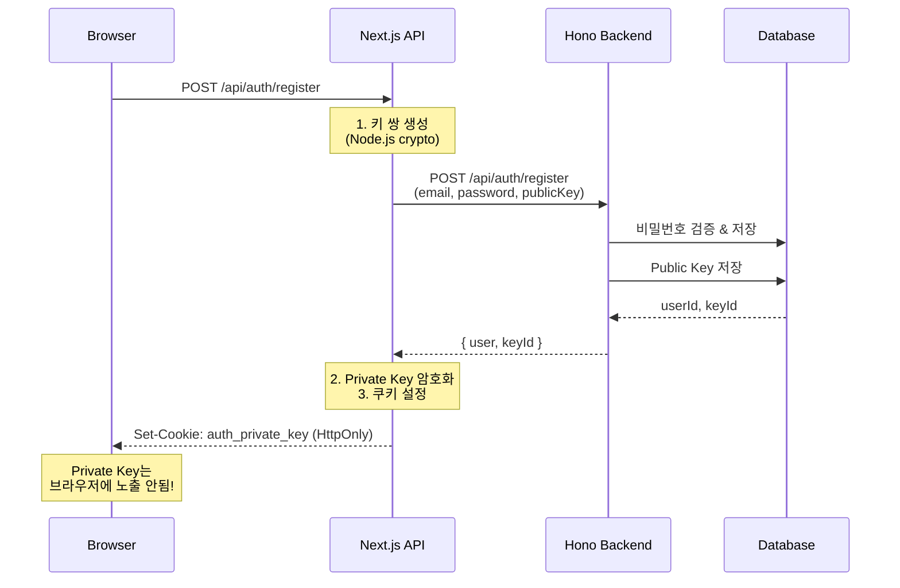
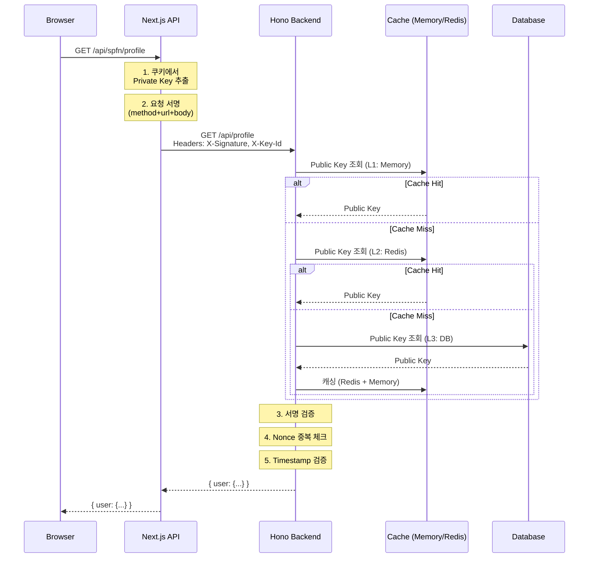

# Client-Key Authentication Architecture

## 전체 플로우

### 1. 회원가입/로그인



### 2. 인증된 API 호출



## 핵심 컴포넌트

### 1. Next.js API Route (서명 자동화)

**역할:**
- Private Key를 암호화된 쿠키로 안전하게 보관
- 모든 API 요청을 자동으로 서명
- 브라우저는 일반 fetch만 사용

**파일:** `src/app/api/spfn/[...path]/route.ts`

```typescript
export async function GET(request: NextRequest, { params }) {
    // 1. 쿠키에서 Private Key 추출
    const encryptedKey = cookies().get('auth_private_key')?.value;
    const privateKey = await decryptPrivateKey(encryptedKey, SECRET);

    // 2. 요청 서명
    const { signature, timestamp, nonce } = await signRequest({
        method: 'GET',
        url: `/api/${path}`,
        body: null,
        privateKey,
    });

    // 3. Hono 백엔드 호출
    const response = await fetch(`http://localhost:4000/api/${path}`, {
        headers: {
            'X-Signature': signature,
            'X-Timestamp': timestamp,
            'X-Nonce': nonce,
            'X-Key-Id': keyId,
        },
    });

    return response;
}
```

### 2. Hono Backend (서명 검증)

**역할:**
- Public Key로 서명 검증
- 3-Tier 캐싱으로 고성능
- Replay Attack 방지

**파일:** `src/server/core/auth/middleware.ts`

```typescript
export function RequireAuth() {
    return async (c: Context, next: Next) => {
        const signature = c.req.header('X-Signature');
        const timestamp = c.req.header('X-Timestamp');
        const nonce = c.req.header('X-Nonce');
        const keyId = c.req.header('X-Key-Id');

        // 1. Replay Attack 체크
        if (Date.now() - Number(timestamp) > 60000) {
            throw new UnauthorizedError('Request expired');
        }

        const nonceExists = await redis.get(`nonce:${nonce}`);
        if (nonceExists) {
            throw new UnauthorizedError('Replay attack detected');
        }
        await redis.setex(`nonce:${nonce}`, 60, '1');

        // 2. Public Key 조회 (3-Tier)
        const publicKey = await getPublicKey(keyId);

        // 3. 서명 검증
        const isValid = await verifySignature({
            method: c.req.method,
            url: c.req.path,
            body: await c.req.text(),
            signature,
            publicKey,
        });

        if (!isValid) {
            throw new UnauthorizedError('Invalid signature');
        }

        // 4. 사용자 조회
        const user = await getUserByKeyId(keyId);
        c.set('user', user);

        await next();
    };
}
```

### 3. 3-Tier 캐싱 시스템

```typescript
class PublicKeyCache {
    private memory: Map<string, PublicKey>;  // L1
    private redis: Redis;                     // L2
    private db: DrizzleDb;                   // L3

    async get(keyId: string): Promise<PublicKey | null> {
        // L1: 메모리 캐시 (~0.001ms)
        if (this.memory.has(keyId)) {
            return this.memory.get(keyId)!;
        }

        // L2: Redis 캐시 (~1ms)
        const cached = await this.redis.get(`pubkey:${keyId}`);
        if (cached) {
            const publicKey = JSON.parse(cached);
            this.memory.set(keyId, publicKey);
            return publicKey;
        }

        // L3: DB 조회 (~10ms)
        const [key] = await this.db
            .select()
            .from(userKeys)
            .where(eq(userKeys.keyId, keyId));

        if (!key) return null;

        // 캐싱
        await this.redis.setex(`pubkey:${keyId}`, 3600, key.publicKey);
        this.memory.set(keyId, key.publicKey);

        return key.publicKey;
    }
}
```

## 보안 메커니즘

### 1. Private Key 보호

```typescript
// AES-256-GCM 암호화
function encryptPrivateKey(privateKey: string, secret: string): string {
    const iv = crypto.randomBytes(16);
    const cipher = crypto.createCipheriv('aes-256-gcm', secret, iv);

    let encrypted = cipher.update(privateKey, 'utf8', 'hex');
    encrypted += cipher.final('hex');

    const authTag = cipher.getAuthTag();

    return JSON.stringify({
        encrypted,
        iv: iv.toString('hex'),
        authTag: authTag.toString('hex'),
    });
}

// HttpOnly Cookie 설정
cookies().set('auth_private_key', encryptedKey, {
    httpOnly: true,              // JavaScript 접근 불가
    secure: true,                // HTTPS only
    sameSite: 'strict',          // CSRF 방어
    maxAge: 60 * 60 * 24 * 7,   // 7일
});
```

### 2. Replay Attack 방지

```typescript
// Nonce: 일회용 랜덤 값
const nonce = crypto.randomUUID();

// Timestamp: 요청 시간 (1분 이내만 유효)
const timestamp = Date.now();

// Redis에 Nonce 저장 (60초 TTL)
await redis.setex(`nonce:${nonce}`, 60, '1');

// 검증
const nonceExists = await redis.get(`nonce:${nonce}`);
if (nonceExists) {
    throw new UnauthorizedError('Replay attack detected');
}

if (Date.now() - timestamp > 60000) {
    throw new UnauthorizedError('Request expired');
}
```

### 3. 서명 알고리즘

```typescript
// 서명 생성 (RS256)
async function signRequest(data: SignData): Promise<Signature> {
    const message = JSON.stringify({
        method: data.method,
        url: data.url,
        body: data.body,
        timestamp: data.timestamp,
        nonce: data.nonce,
    });

    const signature = crypto.sign(
        'RSA-SHA256',
        Buffer.from(message),
        {
            key: data.privateKey,
            padding: crypto.constants.RSA_PKCS1_PSS_PADDING,
        }
    );

    return signature.toString('base64');
}

// 서명 검증
async function verifySignature(data: VerifyData): Promise<boolean> {
    const message = JSON.stringify({
        method: data.method,
        url: data.url,
        body: data.body,
        timestamp: data.timestamp,
        nonce: data.nonce,
    });

    return crypto.verify(
        'RSA-SHA256',
        Buffer.from(message),
        {
            key: data.publicKey,
            padding: crypto.constants.RSA_PKCS1_PSS_PADDING,
        },
        Buffer.from(data.signature, 'base64')
    );
}
```

## 확장 시나리오

### 1. 여러 디바이스 관리

```typescript
// 사용자의 모든 디바이스 조회
const devices = await db
    .select()
    .from(userKeys)
    .where(
        and(
            eq(userKeys.userId, userId),
            isNull(userKeys.revokedAt)
        )
    );

// 특정 디바이스만 로그아웃
await revokeKey(keyId);

// 모든 디바이스 로그아웃
await revokeAllKeys(userId);
```

### 2. 키 로테이션

```typescript
// 정기적 키 교체
async function rotateKey(userId: number, oldKeyId: string) {
    // 1. 새 키 쌍 생성
    const { privateKey, publicKey, keyId } = await generateKeyPair();

    // 2. 새 키 저장
    await savePublicKey(userId, keyId, publicKey);

    // 3. 이전 키 무효화 (7일 유예)
    await scheduleKeyRevocation(oldKeyId, 7 * 24 * 60 * 60);

    // 4. 새 Private Key를 쿠키로 반환
    return { privateKey, keyId };
}
```

### 3. 권한 관리 (RBAC)

```typescript
export function RequireAuth(options?: {
    roles?: string[];
    permissions?: string[];
}) {
    return async (c: Context, next: Next) => {
        // 서명 검증
        const user = await verifyAndGetUser(c);

        // Role 확인
        if (options?.roles && !options.roles.includes(user.role)) {
            throw new ForbiddenError('Insufficient role');
        }

        // Permission 확인
        if (options?.permissions) {
            const hasPermission = options.permissions.every(p =>
                user.permissions.includes(p)
            );
            if (!hasPermission) {
                throw new ForbiddenError('Insufficient permissions');
            }
        }

        c.set('user', user);
        await next();
    };
}

// 사용
export const middlewares = [RequireAuth({ roles: ['admin'] })];
```

## 성능 최적화

### 1. 캐시 히트율 최적화

```typescript
// 캐시 워밍 (서버 시작 시)
async function warmCache() {
    // 최근 활성 사용자의 Public Key 미리 로드
    const activeUsers = await db
        .select()
        .from(userKeys)
        .where(
            and(
                isNull(userKeys.revokedAt),
                gte(userKeys.lastUsedAt, new Date(Date.now() - 24 * 60 * 60 * 1000))
            )
        )
        .limit(1000);

    for (const key of activeUsers) {
        await publicKeyCache.set(key.keyId, key.publicKey);
    }
}
```

### 2. Connection Pool

```typescript
// Redis Connection Pool
const redis = new Redis({
    host: process.env.REDIS_HOST,
    port: 6379,
    maxRetriesPerRequest: 3,
    lazyConnect: true,
    enableReadyCheck: true,
});

// DB Connection Pool (Drizzle + postgres.js)
const pool = postgres(DATABASE_URL, {
    max: 20,
    idle_timeout: 20,
    connect_timeout: 10,
});
```

## 마이그레이션 전략

### 기존 JWT에서 마이그레이션

```typescript
// 1단계: 병렬 운영
export function RequireAuth() {
    return async (c: Context, next: Next) => {
        // Client-Key 시도
        try {
            const user = await clientKeyAuth.verify(c);
            c.set('user', user);
            return await next();
        } catch (e) {
            // JWT Fallback
            const user = await jwtAuth.verify(c);
            c.set('user', user);
            return await next();
        }
    };
}

// 2단계: 사용자에게 키 재발급 안내

// 3단계: JWT 완전히 제거
```

## 모니터링

```typescript
// 성능 메트릭
logger.info({
    module: 'auth',
    keyId,
    cacheHit: 'L1',  // L1, L2, L3
    duration: '0.1ms',
});

// 보안 이벤트
logger.warn({
    module: 'auth',
    event: 'replay_attack',
    keyId,
    ip: request.ip,
});
```

## 다음 단계

- [ ] OAuth 통합 (Google, GitHub)
- [ ] 2FA (TOTP)
- [ ] Passkey/WebAuthn
- [ ] 생체 인증 (모바일)